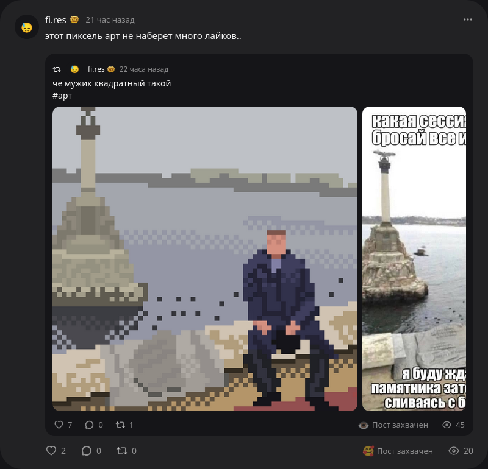

# itdshot

Скриншотер ИТД.


> Пример готового скриншота

## Установка
```bash
uv tool install itdshot
```
В будущем будет добавлена поддержка .exe (через pyinstaller).

## Использование
```bash
itdshot [ссылка на пост или id]
```

## Roadmap

 - [+] Посты
   - [+] Вложения
     - [х] Фото
     - [ ] Видео
   - [ ] Опросы
   - [+] Оригинальный пост
     - [х] Вложения
     - [ ] Опросы
   - [ ] Несколько постов
 - [ ] Пользователи
 - [ ] Комментарии
   - [ ] Ответы
   - [ ] Вложения
     - [ ] Фото
     - [ ] Видео
     - [ ] Голосовые
